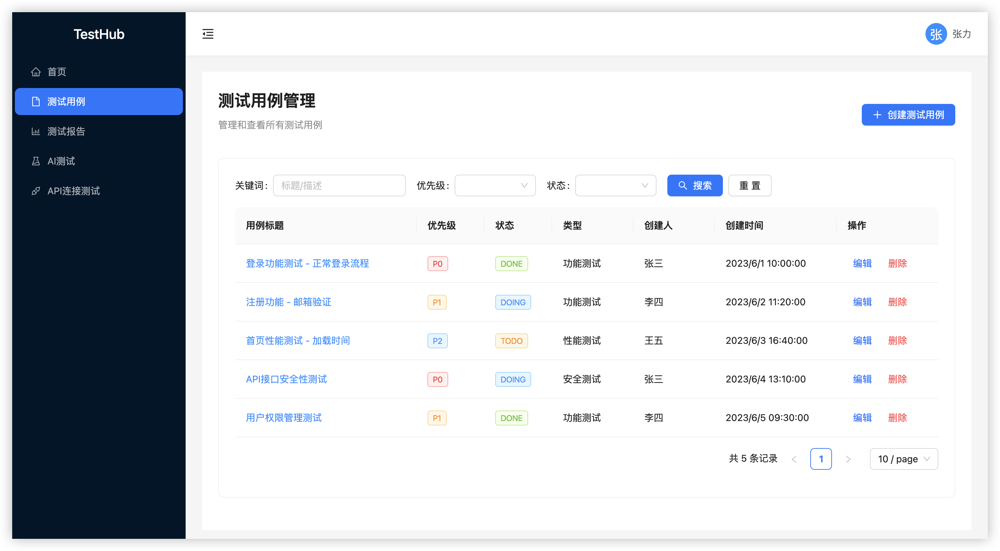
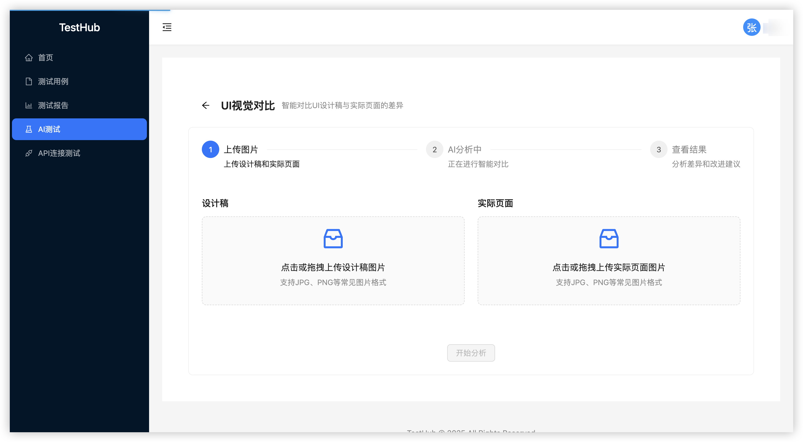

# TestHub 测试用例管理平台

TestHub是一个功能完善的测试用例管理平台，帮助测试团队高效管理测试用例、生成测试报告，并通过AI能力提升测试效率。

## 🚀 功能特点

- 📝 测试用例管理：创建、编辑、分类和查询测试用例
- 📊 测试报告生成：自动生成详细的测试报告和统计数据
- 👥 用户权限管理：多角色权限控制，支持团队协作
- 🤖 AI辅助测试：支持UI对比测试，自动发现界面差异
- 📱 响应式设计：支持PC和移动设备访问

## 📸 功能预览

### 测试用例管理




### AI测试




## 🔧 技术栈

### 前端
- Vue 3 + TypeScript
- Ant Design Vue 组件库
- Vite 构建工具
- Pinia 状态管理
- Vue Router 路由管理
- Axios 网络请求

### 后端
- Spring Boot 2.7.14
- Spring Security + JWT认证
- MyBatis-Plus 3.5.3.1
- MySQL数据库
- Knife4j API文档

## 🛠️ 系统架构

```
TestHub
├── 前端 (Vue 3 + TypeScript)
│   ├── 登录注册模块
│   ├── 用户管理模块
│   ├── 测试用例管理模块
│   ├── 测试报告模块
│   └── AI辅助测试模块
│
└── 后端 (Spring Boot)
    ├── 用户认证服务
    ├── 用户管理服务
    ├── 测试用例服务
    ├── 测试报告服务
    └── AI对比分析服务
```

## 🏁 快速开始

### 系统要求
- JDK 11或更高版本
- Node.js 14或更高版本
- MySQL 5.7或更高版本

## 📚 主要功能模块

### 用户管理
- 用户注册、登录和认证
- 用户角色和权限管理
- 用户个人信息管理

### 测试用例管理
- 测试用例的创建、编辑、删除和查询
- 测试用例分类和标签管理
- 测试用例导入导出
- 测试用例执行状态跟踪

### 测试报告
- 测试执行情况统计
- 测试通过率和失败率分析
- 测试报告生成和导出
- 测试趋势分析

### AI辅助测试
- UI界面对比分析
- 自动识别UI设计稿与实际页面差异
- 提供详细的分析报告和改进建议

## 📄 协议

[MIT License](LICENSE) 
